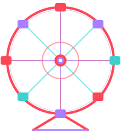

# OLYCITY

<p align="center">
  
</p>

<p align="center">
  Le hub du Discord OLYCITY pour suivre Valorant et League of Legends,<br>
  choisir les prochains jeux coop et organiser les sessions du groupe.
</p>

<p align="center">
  <a href="https://liam-thorel.github.io/OLYVALO/"><strong>Ouvrir OLYCITY</strong></a>
  ·
  <a href="https://github.com/liam-thorel/OLYVALO/releases/latest"><strong>Télécharger OLYCITY Live</strong></a>
</p>

<p align="center">
  <a href="https://github.com/liam-thorel/OLYVALO/actions/workflows/tests.yml"></a>
  <a href="https://github.com/liam-thorel/OLYVALO/actions/workflows/pages.yml"></a>
</p>

## Le projet

OLYCITY réunit dans une même application web les outils utilisés par le groupe : compositions Valorant, rosters et rangs, parties en direct, historiques séparés par jeu, votes coop, organisation des soirées et classement des points Discord.

Le site est une PWA responsive installable sur ordinateur et téléphone. Il fonctionne en JavaScript natif, sans framework ni étape de compilation, et est publié automatiquement avec GitHub Pages.

## Fonctionnalités

### Valorant

- rotation compétitive du patch courant et trois compositions par map : **Ranked**, **Pro** et **Fun** ;
- conseils de map et lineups vidéo utiles ;
- roster avec rang actuel, peak historique, statistiques de l’acte et trois agents les plus joués ;
- détection du sélecteur d’agents, du côté attaque/défense, de la partie et du serveur Riot ;
- regroupement automatique des amis présents dans la même partie et prise en charge de plusieurs sessions simultanées ;
- historique progressif séparant compétitif, deathmatch et autres modes, avec filtres par joueur et période.

### League of Legends

- roster avec rang SoloQ, bilan de saison, rôle principal et top 3 champions SoloQ ;
- détection du compte connecté et des parties via le client League ;
- Live et historique indépendants de Valorant ;
- synchronisation globale des statistiques depuis le roster.

### Vie du groupe

- profils OLYCITY communs au Live, aux votes et aux réponses de soirée ;
- catalogue de jeux coop enrichi avec IGDB et Steam : jaquette, genres, joueurs et avis Steam ;
- statuts **À faire**, **Prévu**, **Joué** et **À rejouer**, votes et tri par ajouts récents ;
- planification d’une session à une date et une heure, réponses Oui/Peut-être/Non et export calendrier ;
- notifications Web Push 30 puis 15 minutes avant une session et lors d’un vrai changement de palier ;
- activité récente sur l’accueil et classement des points du bot Discord.

### Administration

Le panneau `#admin`, réservé au groupe, centralise les installations Live, les comptes Riot détectés, les associations avec les membres, les diagnostics de version et le test des notifications. Les comptes secondaires restent rattachés au bon profil même après un changement de Riot ID.

## OLYCITY Live

OLYCITY Live est le compagnon Windows distribué dans les [Releases GitHub](https://github.com/liam-thorel/OLYVALO/releases/latest). Il lit uniquement les API locales des clients Riot puis publie dans Firebase les informations nécessaires au site.

- runtime Node.js et dépendances inclus dans le ZIP ;
- installation en un clic avec `INSTALLER.bat` ;
- démarrage silencieux avec Windows et verrou anti-doublon ;
- identification du membre une seule fois, modifiable avec `IDENTITE.bat` ;
- mises à jour automatiques, différées jusqu’à la fin de la partie si nécessaire ;
- outils `VERIFIER.bat`, `REINSTALLER.bat` et `DESINSTALLER.bat` pour le dépannage.

Consultez [la documentation du Live](live/README.md) pour le fonctionnement détaillé.

## Bot Discord

Le dossier [`discord-bot/`](discord-bot/) contient un service distinct du site. Il publie les débuts et fins de parties Valorant/LoL, les récaps, les variations de rang et gère les paris fictifs ainsi que leur classement. Son déploiement possède son propre workflow et n’est pas nécessaire au fonctionnement du site ou du catalogue coop.

## Architecture

```text
OLYVALO/
├── index.html                  Application web monopage
├── css/                        Design system et responsive
├── js/                         Pages, Firebase, Live et interactions
├── data/                       Compositions, roster et métadonnées
├── assets/                     Identité visuelle et illustrations
├── live/                       Compagnon Windows autonome
├── workers/
│   ├── game-catalog/           Recherche IGDB + Steam
│   └── notifications/          Web Push, rappels et rank-ups
├── discord-bot/                Bot Discord indépendant
├── tests/                      Suite Node.js sans dépendances
└── .github/workflows/          Tests, Pages, Live et bot
```

### Technologies

- HTML, CSS et modules ES JavaScript ;
- Firebase Realtime Database pour la présence, les sessions, les historiques et les données du groupe ;
- API locales Riot Client, PVP.net et League Client ;
- Riot Data Dragon, HenrikDev, IGDB et Steam pour les données enrichies ;
- Cloudflare Workers et KV pour le catalogue et les notifications ;
- GitHub Actions, GitHub Pages et Releases.

## Développement local

Le site n’a pas de build. Depuis la racine du dépôt :

```powershell
python -m http.server 43173 --bind 127.0.0.1
```

Puis ouvrir `http://127.0.0.1:43173/`.

Lancer toute la suite de tests :

```powershell
node --test
```

Les changements du site déployés sur `main` passent d’abord par les tests, puis par le workflow GitHub Pages. Le Live, les Workers et le bot disposent de procédures de déploiement séparées.

## Configuration du déploiement

Le workflow Pages génère `config.js` à partir de la configuration GitHub :

- secret `HENRIK_API_KEY` pour la clé HenrikDev partagée facultative ;
- variable `GAME_CATALOG_ENDPOINT` pour le Worker de recherche coop ;
- variable `NOTIFICATION_ENDPOINT` pour le Worker Web Push.

Une clé HenrikDev personnelle peut également être renseignée depuis le roster et reste stockée dans le navigateur. Le site continue de fonctionner sans clé partagée, sans catalogue distant ou sans notifications : ces intégrations sont chargées comme des améliorations facultatives.

## Données et crédits

- compositions et tendances Valorant : VLR.gg, RIB.gg et MetaBot ;
- agents et illustrations associées : valorant-api.com et Riot Games ;
- League of Legends : API locales Riot et Data Dragon ;
- catalogue coop : IGDB et Steam ;
- visuels d’accueil : sources détaillées dans [`assets/home/SOURCES.md`](assets/home/SOURCES.md).

OLYCITY est un projet communautaire non affilié à Riot Games, Valve, Twitch ou Discord.
